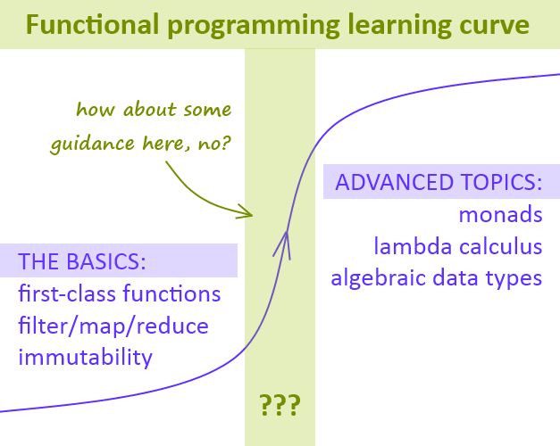
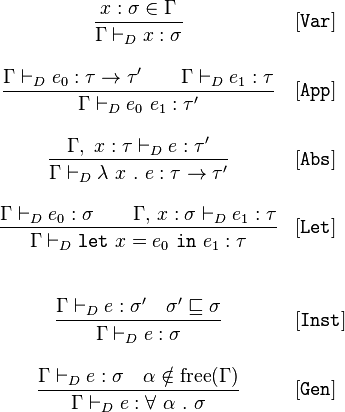
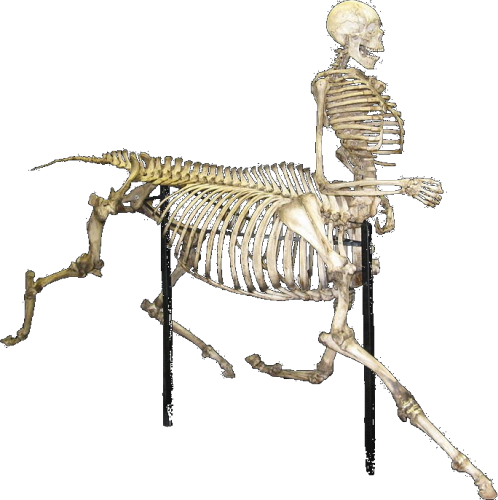

&nbsp;

# &nbsp;Life w/o Objects  <!-- .element: style="color: #42affa" -->

## &nbsp;OOP &#8594; Functional &nbsp;Design&nbsp;

#### &nbsp;with Clojure  <!-- .element: style="color: #d0f0ff" -->

&nbsp;

&nbsp;

(Osvaldas Grigas | [@ogrigas](http://twitter.com/ogrigas))

  <!-- .element: class="plain" width="150" -->

---

#### OOP Hangover

---

 <!-- .element: class="plain" -->

---

 <!-- .element style="background: white; padding: 0.5em" -->

**type systems**

---

 <!-- .element: class="plain" -->

**"hybrid" languages**
