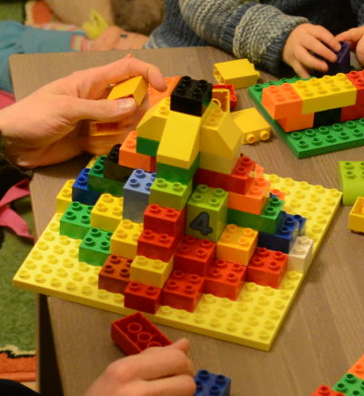

## Design

---

### Design

| Before | After |
| ------ | ----- |
|  |  |

---

### OO Design 

- Noun-oriented   <!-- .element: class="fragment" -->
- Verb-oriented   <!-- .element: class="fragment" -->
- Domain-driven?  <!-- .element: class="fragment" -->

---

### Nouns 

- CustomerDAO
- CustomerService
- CustomerController

---

### Verbs 

- RegisterCustomer
- PromoteCustomerToVIP
- RenderCustomerProfilePage

---

### OO Design Principles

- Single Responsibility
- Interface Segregation
- Dependency Inversion

---

### Single Responsibility

```java
public class ZipDownloadService {

    public List<File> downloadAndExtract(String location) { }

}
```

---

### Single Responsibility

```java
public class FileDownloader {

    public List<File> downloadFiles(String location) { ... }

}
```

```java
public class ZipExtractor {

    public File extractZip(File archive) { ... }

}
```

---

### Or ... just functions

```clojure
(defn download-files [location] (...))

(defn extract-zip [archive] (...))
```

---

### Clojure

<p><strong class="fragment" data-fragment-index="1">in a nutshell</strong></p>

<p class="fragment" data-fragment-index="2">
  <span class="fragment" data-fragment-index="3">(</span>
  some-function
  <span class="fragment fade-out" data-fragment-index="3">(</span>
  arg1
  <span class="fragment fade-out" data-fragment-index="4">,</span>
  arg2
  <span class="fragment fade-out" data-fragment-index="4">,</span>
  arg3
  )
</p>

---

### Interface Segregation

```csharp
public class ProductCatalog
{
    public ProductId Save(Product product)
    {
        ...
    }
    
    public Product FindById(ProductId id)
    {
        ...
    }
}
```

---

### Interface Segregation

```csharp
public class ProductSaver
{
    public ProductId Save(Product product)
    { ... }
}
```

```csharp
public class ProductFinder
{
    public Product FindById(ProductId id)
    { ... }
}
```

---


Somethin' ain't right

---

### Interface Segregation

```csharp
public class ProductRepository
{
    public ProductId Save(Product product)
    { ... }
}
```

```csharp
public class ProductQuery
{
    public Product FindById(ProductId id)
    { ... }
}
```

---


Feelin' good now

---

### Or ... just functions

```clojure
(defn save-product [product] (...))

(defn find-product-by-id [id] (...))
```

---

**Applying OO design principles<br/>
often leads to...<br/>**

**functional design**  <!-- .element class="fragment" -->

---

### What's missing

- Code organization
- Encapsulation
- Inheritance hierarchies
- Polymorphism

---

#### No code organization?

```clojure
(ns my.product.repository)

(defn save [product] (...))

(defn find-by-id [id] (...))
```

```clojure
(require '[my.product.repository :as product-repo])

(product-repo/find-by-id 42)
```

---

#### No encapsulation?

- Data is _not_ an object  <!-- .element: class="fragment" -->
- Data is immutable        <!-- .element: class="fragment" -->

---

#### No inheritance hierarchies?

**Who cares!**  <!-- .element: class="fragment" -->

---

#### No polymorphism?

We'll get there  <!-- .element: class="fragment" -->
