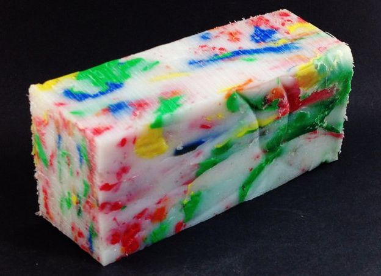

## Design

---

### Monolithic Design



---

### Modular Design


---

### Design process

| Before | After |
| ------ | ----- |
|  <!-- .element width="380" height="360" --> |  <!-- .element width="350" height="360" --> |

---

### OO Design 

- Noun-oriented
- Verb-oriented

---

### Nouns 

- CustomerDAO
- CustomerService
- CustomerController

---

### Verbs 

- RegisterCustomer
- PromoteCustomerToVIP
- RenderCustomerProfilePage

---

**Domain-driven design?**

---

### OO Design Principles

- Single Responsibility
- Interface Segregation
- Dependency Inversion

---

### Single Responsibility

---

```java
public class ZipDownloadService {

    List<File> downloadAndExtract(String location) {
        ...
    }
}
```

---

```java
public class FileDownloader {

    List<File> downloadFiles(String location) {
        ...
    }
}
```

```java
public class ZipExtractor {

    File extractZip(File archive) {
        ...
    }
}
```

---

Or ... just functions

```clojure
(defn download-files [location]
  (...))

(defn extract-zip [archive]
  (...))
```

---

### Clojure

in a nutshell

```clojure
  
```

---

### Clojure

in a nutshell

```java
 calculate(5, 2, 9)
```

---

### Clojure

in a nutshell

```clojure
(calculate 5, 2, 9)
```

---

### Clojure

in a nutshell

```clojure
(calculate 5 2 9)
```

---

### Function definition

```clojure
(defn calculate [a b c]
  (+ a (* b c)))
```

---

### Interface Segregation

---

```csharp
public class ProductCatalog
{
    public void Save(Product product)
    {
        ...
    }

    public Product FindById(int productId)
    {
        ...
    }
}
```

---

```csharp
public class ProductSaver
{
    public void Save(Product product)
    {
        ...
    }
}
```

```csharp
public class ProductFinder
{
    public Product FindById(int id)
    {
        ...
    }
}
```

---


Somethin' ain't right

---

```csharp
public class ProductRepository
{
    public void Save(Product product)
    {
        ...
    }
}
```

```csharp
public class ProductQuery
{
    public Product FindById(int id)
    {
        ...
    }
}
```

---


Feelin' good now

---

Or ... just functions

```clojure
(defn save-product [product]
  (...))

(defn find-product-by-id [id]
  (...))
```

---

**Applying OO design principles<br/>
often leads to<br/>
functional design**
