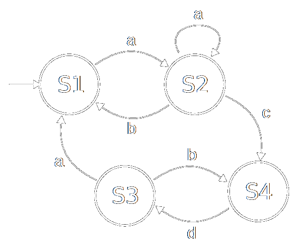

## What's missing

---

### What's missing

- Code organization
- Encapsulation
- Inheritance hierarchies
- Composition &amp; Polymorphism

---

#### Code organization

---

```clojure
(ns my.product.repository)

(defn save [product]
  (...))

(defn find-by-id [id]
  (...))
```

```clojure
(ns my.other.namespace
  (:require [my.product.repository :as product-repo]))

(product-repo/find-by-id 42)
```

---

#### Encapsulation

---

#### Encapsulation

- Data is _not_ an object
- &nbsp;

---

#### Encapsulation

- Data is _not_ an object
- Data is immutable

---

```clojure
(html [:body
        [:h1 "Employees"]
        [:ul
        (for [person employees]
          [:li
            [:h2 (:name person)]
            [:p (:email person)]])]])
```

---

```clojure
(defn handle [request]
  {:status 200
   :headers {"Content-Type" "application/json"
             "X-Custom-Header" "12345"}
   :body (json/generate-string
           {:name "John Wick"
            :age 42
            :email "john@wick.name"
            :hobbies ["guns" "dogs" "judo"]})})
```

---

```clojure
(defentity person)

(select person
  (fields :name :age :email)
  (where {:nationalId "38211109999"
          :country "LT"}))
```

---
<p style="font-size: 0.55em">
append-child array-map assoc 
associative? assoc-in bean bigdec bigint biginteger bit-and 
bit-and-not bit-clear bit-flip bit-not bit-or bit-set 
bit-shift-left bit-shift-right bit-test bit-xor blank? branch? 
butlast byte capitalize cat char char? char-escape-string 
char-name-string children coll? compare concat conj cons 
contains? count counted? cycle dec dec' decimal? dedupe 
dense-int-set diff difference disj dissoc distinct distinct? 
double down drop drop-last drop-while edit eduction empty empty? 
end? enumeration-seq escape even? every? false? ffirst file-seq 
filter filterv find find-keyword first flatten float float? 
fnext for format frequencies gensym get get-in group-by hash-map 
hash-set identical? inc inc' index insert-child insert-left 
insert-right int integer? interleave interpose intersection 
int-map into into-array int-set iterate iterator-seq join keep 
keep-indexed key keys keyword keyword? last lazy-cat lazy-seq 
left leftmost lefts line-seq list list? list* long lower-case 
make-node map map? mapcat map-indexed map-invert mapv max 
max-key merge merge-with min min-key mod neg? next nfirst nil? 
nnext node not not= not-any? not-empty not-every? nth nthnext 
nthrest num number? odd? partition partition-all partition-by 
path peek pmap pop pos? postwalk postwalk-demo postwalk-replace 
prev prewalk prewalk-demo prewalk-replace priority-map project 
quot rand rand-int rand-nth random-sample range ratio? rational? 
rationalize reduce reduce-kv reductions re-find re-groups rem 
re-matcher re-matches remove rename rename-keys re-pattern 
repeat repeatedly replace replace-first re-quote-replacement 
re-seq rest resultset-seq reverse reversible? right rightmost 
rights root rseq rsubseq second select select-keys seq seq? 
seque sequence sequential? seq-zip set set? short shuffle some 
some? sort sort-by sorted? sorted-map sorted-map-by sorted-set 
sorted-set-by split split-at split-lines split-with str string? 
subs subseq subset? subvec superset? symbol symbol? take 
take-last take-nth take-while to-array-2d transduce tree-seq 
trim triml trim-newline trimr true? unchecked-add unchecked-dec 
unchecked-inc unchecked-multiply unchecked-negate 
unchecked-subtract union unsigned-bit-shift-right up update 
update-in upper-case val vals vec vector vector? vector-of 
vector-zip walk when-first xml-seq xml-zip zero? zipmap
</p>

---

 <!-- .element class="plain" height="360" -->

Process / Entity / State Machine

---

#### Inheritance hierarchies

&nbsp;

---

#### Inheritance hierarchies

just don't

---

#### Composition &amp; Polymorphism

&nbsp;
