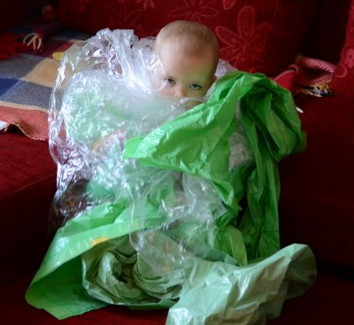

## Polymorphism

---


---

### Polymorphism

I don't know.  
I don't want to know.

---

### Basic FP polymorphism

- All functions implement the "Strategy" pattern

---

### OO Polymorphism

- Interfaces / Subclasses
- Dispatch on the type of first argument

---

```java
public interface JsonObj {
    String toJson();
}
```

---

```java
public class JsonString implements JsonObj {
    private final String value;
    
    public JsonString(String value) {
        this.value = value;
    }
    
    public String toJson() {
        return "\"" + value + "\"";
    }
}
```

---

```java
public class JsonList implements JsonObj {
    private final List<? extends JsonObj> list;
    
    public JsonString(List<? extends JsonObj> list) {
        this.list = list;
    }
    
    public String toJson() {
        return "[" +
            list.stream()
                .map(JsonObj::toJson)
                .collect(joining(",")) +
            "]";
    }
}
```

---

```java
JsonObj obj = new JsonList(asList(
      new JsonString("a"),
    new JsonList(asList(
        new JsonString("b"),
        new JsonString("c")
    )),
    new JsonString("d")
));

System.out.println(obj.toJson());

// ["a",["b","c"],"d"]
```

---

#### Limitations

- Need wrapper types
- Cannot extend existing types

---



Too constraining!

---

### Clojure Protocols

**dispatch on the type of first argument**

---

```clojure
(defprotocol Json
  (to-json [this]))
```

---

```clojure
(extend-type String Json
  (to-json [this]
    (str "\"" this "\"")))
```

```clojure
(extend-type List Json
  (to-json [this]
    (str "[" (->> this (map to-json) (string/join ",")) "]")))
```

```clojure
(extend-type nil Json
  (to-json [this]
    "null"))
```

---

```clojure
(to-json ["a" ["b" "c"] nil "d"])

;;=> ["a",["b","c"],null,"d"]
```

---


Why stop there?

---

### Clojure Multimethods

**dispatch on anything!**

---

```clojure
(defmulti greet :country)

(defmethod greet "PL" [person]
  (println "Dzień dobry," (:name person)))

(defmethod greet "FR" [person]
  (println "Bonjour," (:name person) "!"))

(defmethod greet :default [person]
  (println "Hello," (:name person)))
```

```clojure
(greet {:name "Jacques" :country "FR"})

;;=> Bonjour, Jacques !
```
